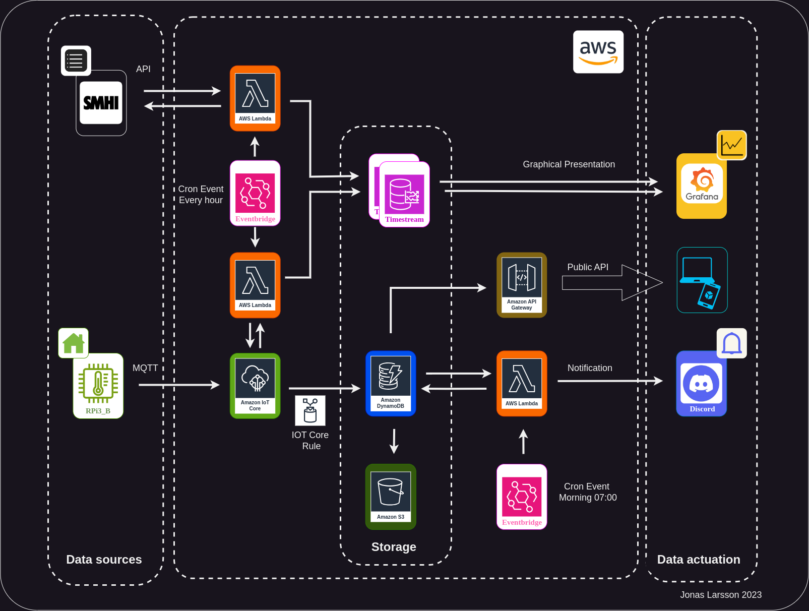
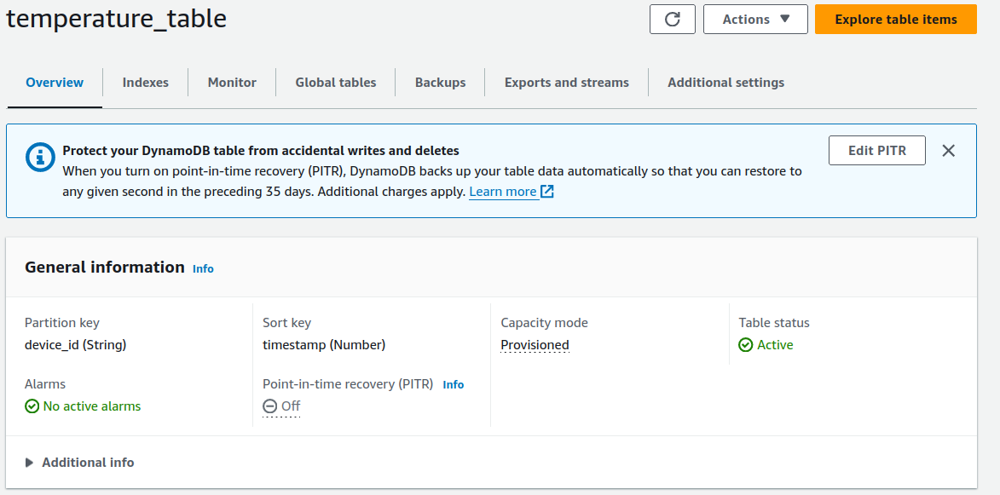
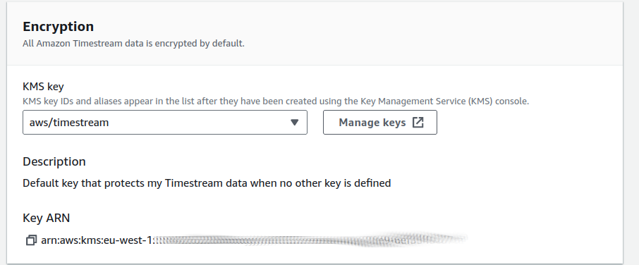
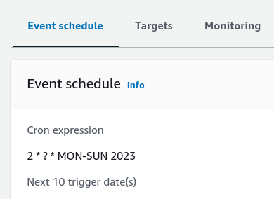
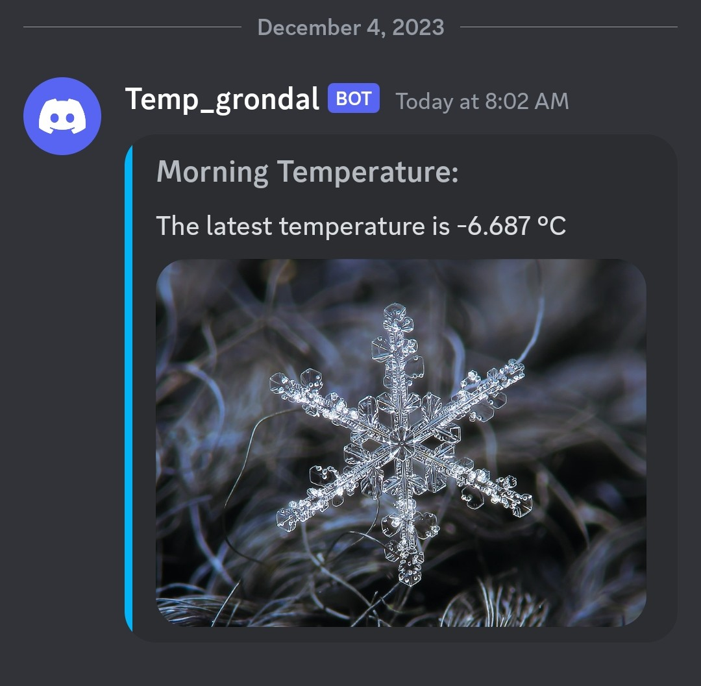
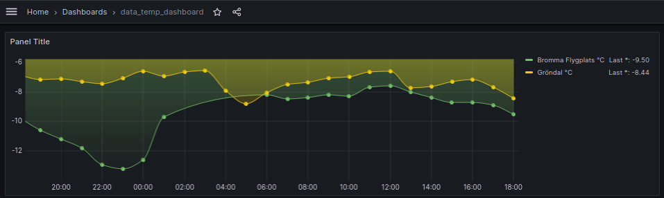

<html>


<div id="top"></div>

<div align="center">
  <a href="https://github.com/j0naslarss0n">
    
  </a>

  <p align="center">Jonas Larsson, IoT och Molntjänster, Nackademin 2023</p>
  <br>

  </br>
<h1 align="center">IoT and AWS Cloud services</h1>

</div>

  <p align="left">
I chose to use the my old trusted Raspberry Pi3 and a temperature sensor. Since this was more about learning the cloud solutions from AWS, my primary concern wasn't so much the data itself. However I found it intriguing to benchmark the the official temperatures from SMHI(Swedish weather institute) at Bromma airport, not far from where I live, about 6 km. The result was quite fascinating, that the graphs may show. 

This project also gave me the oportunity to add a morning notification about the temperature, which is nice to know especially during this cold season. 
    
    
  </p>


<h2 align="center">Solution and flowchart</h3>
 <div align="center">
  <a>
    
  </a>

</div>


<h2 align="center">Hardware</h3>
<div>
<p align="left">
 <ul>
  <li>Raspberry Pi3</li>
  <li>Temperature sensor DS18B20 </li>
  <li>Cables and breadbord</li>
</ul> 
</div>


<h2 align="center">Software and tools</h2>
<div>
<p align="left">
 <ul>
  <li>AWS</li>
   <ul>
    <li>Lambda</li>  
    <li>DynamoDB</li>
    <li>Eventbridge</li>
    <li>AWS IoT</li>
    <li>S3</li>
    <li>API Gateway</li>
  </ul>
  <li>Rasbian OS </li>
  <li>Draw.io</li>
  <li>Python</li>
  <li>Node.js</li>

</ul> 
</div>


<h1 align="center">Setup Raspberry Pi3 </h1>
<div>
<p align="left">
  I set up the Raspberry Pi 3B with Rasbian OS, install is quite straight forward with Raspberrys own installation tool and there are several settings for Wifi-connection and SSH from get go. With SSH it was easy to access the Raspberry and prepare it to send data.
  As always update the software on a new install
  
  ``` 
  sudo apt update && sudo apt dist-upgrade
  ```   
  I used python for the script on the Raspberry to publish my data, to do so I needed to install dependenicies to communicate with AWS using MQTT, these are installed with pip so first install that.
  ```
  sudo apt install pip
  ```
  then install dependencies for AWS IoT.
  
  ```
  sudo apt install pip3-AWSIoTPythonSDK
  ```

  I found <a href="https://circuitdigest.com/microcontroller-projects/publish-sensor-data-to-amazon-aws-raspberry-pi-iot">this</a> walkthrough which was handy and had a neat setup for the certificates and access keys. Instead of a 'copy-paste-document' I could use the whole folder from AWS and refer to the keys and certificates in the folder. This could be good if there would be many IoThings in a IoT-solution. 
    

  The terminal snippet below is made after creating your 'IoT thing' on AWS.

  ```
  jonas@raspberrypi:~/aws_temp $ tree
.
├── RPi3_policy
│   ├── f44f4106df9/.../dsa32h8179-certificate.pem.crt
│   ├── 201f44f4106df/.../8134fsasdkk279-private.pem.key
│   ├── 1f44f4106df9/.../esd982dase8928179-public.pem.key
│   ├── AmazonRootCA1.pem
│   └── AmazonRootCA3.pem
└── temp_pub.py

2 directories, 6 files

  ```
The python script is not set on a loop, instead I used a crontab on the RPi3. This will make the script run every hour and publish the data to the AWS IoT thing. To do this edit the crontab with 

```
crontab -e
```
and add the followng line in the bottom.

```
*/60 * * * * python3 /path/to/your/script.py
```


</p>

</div>


<h1 align="center">Setup AWS </h1>
<div>

When creating a account at AWS, make sure to chose a server that contains the AWS pieces you would like to use, for instance Timestream isn't available on the Swedish server, so I chose Ireland. 🍀


<h3 align="center">AWS IoT</h3>
<p align="left">


I initially created a thing in <i><b>AWS Iot -> All devices -> Things and Create thing</i></b> chose a name and press next. Chose Autogenerate certificate and attach a policy, if there isn't any then create a policy to your thing and download the whole folder with keys and certificates (to give your physical thing access).
The policy is created within the AWS IoT in <i><b>AWS Iot-> Security -> Policies</i></b>. They can be made with the builder or written in json and should look something like this in json. 

Copy the downloaded certificate folder and files with scp to your device, in my case the Raspberry Pi3, so that it is accessable for your script.
With the <i><b>MQTT test client</i></b> you should be able to see your device pushing in data with your topic or see all with `#` flag. 
I set my topic as `area/thing-name/source/pub`.

```{
  "Version": "2012-10-17",
  "Statement": [
    {
      "Effect": "Allow",
      "Action": "iot:Connect",
      "Resource": "arn:aws:iot:eu-west-1:84XXXXXXXX66:client/RPi3_B"
    },
    {
      "Effect": "Allow",
      "Action": "iot:Publish",
      "Resource": "arn:aws:iot:eu-west-1:84XXXXXXXX66:topic/grondal/RPi3_B/temperature/pub"
    },
    {
      "Effect": "Allow",
      "Action": "iot:Receive",
      "Resource": "arn:aws:iot:eu-west-1:84XXXXXXXX66:topic/grondal/RPi3_B/temperature/pub"
    },
    {
      "Effect": "Allow",
      "Action": "iot:Subscribe",
      "Resource": "arn:aws:iot:eu-west-1:84XXXXXXXX66:topicfilter/grondal/RPi3_B/temperature/pub"
    }
  ]
}
```

---
<h3 align="center">DynamoDB</h2>

I chose to create a both DynamoDB and Timestream but most of this could be done with only Timestream database.

Create a table from <i><b>Tables > Create table</b></i>. Enter a name and partion key and sortkey, in my case I chose <b>device_id(String)</b> and <b>timestamp(Number)</b>.



---
<h3 align="center">S3</h2>

AWS S3 is a cold storage service that allow you to long term save your data. I didn't do this as it comes with a fee outside the scope of this exercise. If S3 would be needed this would also need to turn on the AWS point-in-time-recovery(PiTR) on your DynamoDB service. To enable this you can see the edit button on the picture above. 


---
<h3 align="center">Timestream</h2>

Timestream is another option of database in the AWS toolbox. I created two (one would probably be sufficient for this small project), one for the SMHI-data and one for my RPi3_B-data. 

Create a database and leave the encryption to `aws/timestream`, then create a table for this database. 



.

For your table chose the database you just created and chose a name for your table. Make <i><b>custom partioning</i></b> and chose <b><i> Dimension </b></i> as <i><b>partition key type</i></b>. In <i><b>partition key name</i></b> chose your device or use the topic position that contain the device name,  <i><b>${topic(2)}</i></b>.

There was a parameter that took me some while to figure out as I couldn't insert my <b>timestamp</b>. It appeared that 'timestamp' _have to be_ in microseconds in Timestream (discussed here), I made a dirty workaround for this occasion, as seen in the Lambda-function for SMHI.

---
<h3 align="center">Lambda</h2>

To tie everthing together and to get some functionality from this I used Lambda functions. One to take data from DynamoDB and send data to Discord, one to fetch data from SMHI to the Timestream database and one to get data from the AWS IoT and send to Timestream database.

I started with sending my temperatures to Discord with creating a script in python. Here's a <a href="https://dev.to/josuebustos/aws-lambda-send-a-message-with-discord-webhooks-12fa">tutorial I followed </a>. There's a key thing which isn't mentioned there, and that is that your python layer need to be in a folder following this naming convetion `python/lib/python3.xx/project_name`, otherwise Lambda will throw you a error message of missing dependencies. 

With that I added for it to fetch the temperature from my RPi3 and put in the webhook message.

To schedule this I used Eventbridge and set the crontab to execute every at 07:02 every morning. I gave it 2 extra minutes to be able to get the data. Here I also noticed that since the server is in Ireland the timezone differs. The options here were either local(Ireland) or UTC, thus this have to be addressed in a production case scenario. 

There may be a proper workaround but I simply added the extra hour in the script.

In a similar fascion I made Lambda functions to get data from SMHI and from the AWS IoT and both them two sent it to the Timestream database.
This cronjob was set to fetch the data second minute every hour as shown below.



.

<h1 align="center">Presentation and Visalisation </h1>
<div>
<p>
 The data is visualised using Grafana and I get a notification on Discord. 
</p>

<h3 align="center">Discord </h3>
<p>

With discord it was fairly simple to create a webhook that and connect that with the Lambda function. Either as a string or embedded message to a bot on my own server.

Now I know every morning if there's a need for long underpants or not, and when spring comes, the need for scarf and hat.




<h3 align="center">Grafana </h3>

Grafana is nice tool I hadn't used before. From Grafana I was able to connect and get the data from Timestream DB, addressing the database and table with a SQL-query. I found it quite intriguing that the gap of 2-4 C between my measurement and that from SMHI. While SMHIs is accurate, my measure could indicate of heat leakage from the house, my camparibly poor hardware, or that my house is in a urban neighberhood and not in the open on a airport. Regardless I found it interesting. 

The query made in Grafana for the my RPi3_B, one of the datasets.

```
SELECT time, measure_value::double AS "Gröndal °C" 
FROM "time_stream_database"."timestream_table" 
WHERE device_id='RPi3_B'
```
<br>

</br>

Grafana output: Bromma flygplats (green), Gröndal (yellow).


---
</p>

</div>


<h1 align="center">Security and Scalability </h1>
<div>
<p>
"The S in IoT stand for Security", which isn't the case in a industry application. However in this project many concearns regarding security have been set aside for functionality. I'll try to address some of those concerns here, what have been implemented and what should've been implemented. I'll also have a breif conclusion on the matter of scalability.
</p>

<h3 align="center">Security </h3>
<p>

While some measures have been taken to secure this project (AWS wont allow less) there are some that hasn't. Connecting the 'thing' with end-2-end ecryption is something that cannot be circumviened. Also keeping your IoT devices to least-privilage when it comes to policies (as mentioned in the AWS IoT section above), no unit should have more priviliges then what the unit need to complete it's task.


The same goes for roles, within the AWS ecosystem there's the <i><b>IAM</i></b> tool, this address each user not to have more then sufficient amount of access to do their tasks. 

During this project I have been on the root account, this is by default on any system a malpractice. To keep a IoT-solution secure users should, aswell as units and devices, follow the principle of least-privilage.
</p>

<h3 align="center">Scalability</h3>
<p>
When it comes to scalability AWS handles much of this as the serivice. It should be possible to add many 'things' to above solution without slowing it down. Be that both vertically or horizontally.

The API Gateway adjust to handle requests, thus handle incoming API traffic and to reduce load on backend services. 


---

Tack till Johan Holmberg för en kanonkurs och alla i IoT22 på Nackademin.

Jonas Larsson 2023
</p>

</div>

</html>
